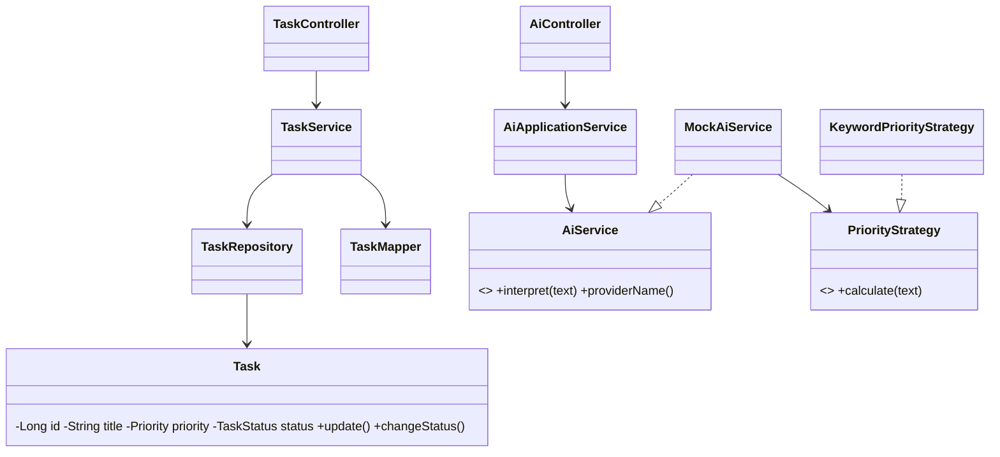

# Diagrama de classes

```mermaid
classDiagram
 class Task { -Long id -String title -Priority priority -TaskStatus status +update() +changeStatus() }
 class TaskController
 class TaskService
 class TaskRepository
 class TaskMapper
 class AiController
 class AiApplicationService
 class AiService { <<interface>> +interpret(text) +providerName() }
 class MockAiService
 class PriorityStrategy { <<interface>> +calculate(text) }
 class KeywordPriorityStrategy
 TaskController --> TaskService
 TaskService --> TaskRepository
 TaskService --> TaskMapper
 TaskRepository --> Task
 AiController --> AiApplicationService
 AiApplicationService --> AiService
 MockAiService ..|> AiService
 MockAiService --> PriorityStrategy
 KeywordPriorityStrategy ..|> PriorityStrategy
```
